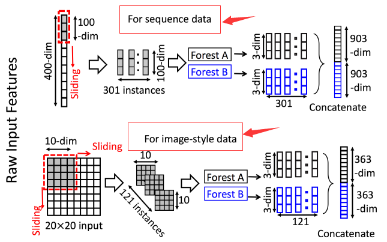
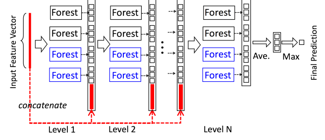

<!-- @import "[TOC]" {cmd="toc" depthFrom=1 depthTo=6 orderedList=false} -->

<!-- code_chunk_output -->

- [常见的集成学习算法并简述](#常见的集成学习算法并简述)
- [决策树如何进行回归与分类](#决策树如何进行回归与分类)
  - [决策树的主要种类](#决策树的主要种类)
  - [为什么CART(Classification and Regression Tree)可以做回归，而ID3和C4.5不可以](#为什么cartclassification-and-regression-tree可以做回归而id3和c45不可以)
  - [决策树的优缺点](#决策树的优缺点)
  - [决策树与随机森林](#决策树与随机森林)
    - [Bagging算法简述](#bagging算法简述)
    - [随机森林算法概述](#随机森林算法概述)
    - [头条面试题：随机森林的随机怎么理解？](#头条面试题随机森林的随机怎么理解answers-listmd头条面试题1)
- [GBDT(Gradient Boosting Decision Tree)与xgboost](#gbdtgradient-boosting-decision-tree与xgboost)
  - [Linear Regression(线性回归)](#linear-regression线性回归)
  - [Logistic Regression(逻辑回归、对数几率回归)(二元逻辑回归)](#logistic-regression逻辑回归-对数几率回归二元逻辑回归)
  - [多元逻辑回归](#多元逻辑回归)
  - [逻辑回归与线性回归的关系](#逻辑回归与线性回归的关系)
  - [GBDT简述](#gbdt简述)
  - [GBDT解决回归问题](#gbdt解决回归问题)
  - [GBDT解决分类问题](#gbdt解决分类问题)
  - [GBDT损失函数](#gbdt损失函数)
  - [xgboost](#xgboost)
    - [xgboost与lightGBM区别](#xgboost与lightgbm区别)
- [GCForest及其改进](#gcforest及其改进)
  - [DNN和GCForest的优缺点](#dnn和gcforest的优缺点)
  - [主要思路](#主要思路)
    - [多粒度扫描](#多粒度扫描)
    - [级联森林](#级联森林)
  - [GCForest改进(云云姐论文)](#gcforest改进云云姐论文)
- [References](#references)

<!-- /code_chunk_output -->

### 常见的集成学习算法并简述

集成学习有两个流派，一个是boosting派系，它的特点是各个弱学习器之间有依赖关系。另一种是bagging流派，它的特点是各个弱学习器之间没有依赖关系，可以并行拟合。

Boosting系列的主要算法为Adaboost和GBDT。

Bagging系列的主要算法为RandomForest。

### 决策树如何进行回归与分类

#### 决策树的主要种类

ID3, C4.5, CART

其中ID3主要是通过信息熵和信息增益进行选择最优属性进行分裂， C4.5主要通过信息增益比进行分裂，CART主要通过基尼系数进行分裂。

- ID3算法。(a) ID3没有考虑连续值，如长度、密度等；(b) ID3没有对缺失值进行考虑；(c) 没有考虑过拟合问题；(d) 在相同条件下取值较多的特征，比取值较小的特征的信息增益大。
$$\begin{aligned}
H(D) & = -\sum_{i=1}^{n}{P_i\log{P_i}} \\
g(D, A) & = H(D) - H(D|A) \\ 
        & = H(D) - \sum_{i=1}^{n}{P_i H(D|A_i)}
\end{aligned}$$其中，$P_i$为当前属性下不同取值的概率，$H(D|A_i)$为当前数据下下，当前属性值时，不同类别的信息熵。

- C4.5算法。解决了ID3的 (d) 问题，特征数越多的特征对应的信息熵越大，应作为分母以矫正信息增益的偏向的问题。

$$I_R{(D, A)} = \frac{g(D, A)}{H(D)}$$

#### 为什么CART(Classification and Regression Tree)可以做回归，而ID3和C4.5不可以

回归决策树主要指CART算法，内部结点特征的取值为“是”和“否”， 为二叉树结构。所谓回归，就是根据特征向量来决定对应的输出值。回归树就是将特征空间划分成若干单元，每一个划分单元有一个特定的输出。因为每个结点都是“是”和“否”的判断，所以划分的边界是平行于坐标轴的。对于测试数据，我们只要按照特征将其归到某个单元，便得到对应的输出值。划分的过程也就是建立树的过程，每划分一次，随即确定划分单元对应的输出，也就多了一个结点。当根据停止条件划分终止的时候，最终每个单元的输出也就确定了，也就是叶结点。

CART可以做回归，而ID3和C4.5不可以回归是因为几个模型的损失函数及分裂方式都不同。

- 分裂方式。CART有两种评价标准：Variance和Gini系数。而ID3和C4.5的评价基础都是信息熵。信息熵和Gini系数是针对分类任务的指标，而**Variance是针对连续值的指标因此可以用来做回归**。

- 损失函数。**对于CART回归模型来讲**，其回归模型采用和方差的形式度量划分特征A的优劣。度量目标是对于划分特征A， 对应的划分点S两边的数据集D1,D2，求出使D1，D2各自集合的均方差最小，同时使D1和D2的均方差之和最小。
$$L = \underbrace{min}_{A, S}[\underbrace{min}_{c1} \sum_{x_i \in D_1(A, S)}{(y_i - c_1)^2} + \underbrace{min}_{c_2} \sum_{x_i \in D_2(A, S)}{(y_i - c_2)^2}]$$**对于分类模型来讲**，采用基尼指数或信息熵等评价指标度量各个划分点的优劣。

#### 决策树的优缺点

决策树的一些优点是：
- 易于理解和解释。决策树可以进行可视化。
- 需要很少的数据准备。其他技术通常需要数据规范化，需要创建伪变量并删除空白值。但是请注意，此模块不支持缺少的值。
- 使用树的成本（即预测数据）与用于训练树的数据点数量成对数。
- 能够处理数字和分类数据。其他技术通常专用于分析仅具有一种类型的变量的数据集。有关更多信息，请参见算法。
- 能够处理**多输出问题**。
- 使用白盒模型。如果模型中可以观察到给定的情况，则可以通过布尔逻辑轻松解释条件。相反，在黑匣子模型中（例如，在人工神经网络中），结果可能更难以解释。
- 可以使用统计测试来验证模型。这使得考虑模型的可靠性成为可能。
- **即使生成数据的真实模型在某种程度上违背了它的假设，也可以表现良好**。

决策树的缺点包括：
- **决策树学习者可能会创建过于复杂的树，从而无法很好地概括数据。这称为过度拟合**。为避免此问题，必须使用诸如剪枝、设置叶节点处所需的最小样本数或设置树的最大深度之类的机制。
- **决策树可能不稳定**，因为数据中的细微变化可能会导致生成完全不同的树。**通过使用集成学习中的决策树可以缓解此问题**。
- 在最优性的几个方面，甚至对于简单的概念，学习最优决策树的问题都被认为是NP完全的。因此，实用的决策树学习算法基于启发式算法（例如贪婪算法），其中在每个节点上做出局部最优决策。这样的算法不能保证返回全局最优决策树。可以通过在集成学习器中训练多棵树来缓解这种情况，在该学习器中，特征和样本将通过替换随机抽样。
- 有些概念很难学习，因为决策树无法轻松表达它们，例如XOR，奇偶校验或多路复用器问题。
- **类别不均衡的处理能力较差，如果某些类别占主导地位，则决策树学习者会创建有偏见的树**。因此，建议在与决策树拟合之前平衡数据集

#### 决策树与随机森林

##### Bagging算法简述

相对于Boosting系列的Adaboost和GBDT，bagging算法要简单的多。

输入为样本集$T = \{ (x_1, y_1), (x_2, y_2), ..., (x_n, y_n) \}$，弱学习器迭代次数为K。算法流程如下:

循环训练弱分类器K次，$t=1, 2, ..., k$
- 对训练集进行第t次随机采样，共采集n次，得到包含n个样本的采样集$D_t$
- 基于采样集$D_t$训练第t个弱学习器

如果是**分类算法预测**，则T个弱学习器投出最多票数的类别或者类别之一为最终类别。如果是**回归算法预测**，T个弱学习器得到的回归结果进行算术平均得到的值为最终的模型输出。

##### 随机森林算法概述

RF较普通的bagging算法有了两处改进。第一，**RF使用了CART决策树作为弱学习器**，这让我们想到了梯度提升树GBDT。第二，在使用决策树的基础上，**RF对决策树的建立做了改进**，对于普通的决策树，我们会在节点上所有的n个样本特征中选择一个最优的特征来做决策树的左右子树划分，但是**RF通过随机选择节点上的一部分样本特征**，这个数字小于n，假设为$n_{sub}$，然后在这些随机选择的$n_{sub}$个样本特征中，选择一个最优的特征来做决策树的左右子树划分。这样进一步增强了模型的泛化能力。　　　　

如果$n_{sub}=n$，则此时RF的CART决策树和普通的CART决策树没有区别。$n_{sub}$越小，则模型约健壮，当然此时对于训练集的拟合程度会变差。也就是说$n_{sub}$越小，模型的方差会减小，但是偏倚会增大。在实际案例中，一般会通过交叉验证调参获取一个合适的$n_{sub}$的值。

常规的随机森林算法的优缺点:
RF的主要优点有：
- 训练可以高度并行化，对于大数据时代的大样本训练速度有优势。个人觉得这是的最主要的优点。
- 由于可以随机选择决策树节点划分特征，这样在样本特征维度很高的时候，仍然能高效的训练模型。
- 在训练后，可以给出各个特征对于输出的重要性
- 由于采用了随机采样，训练出的模型的方差小，泛化能力强。
- 相对于Boosting系列的Adaboost和GBDT， RF实现比较简单。
- 对部分特征缺失不敏感。

RF的主要缺点有：
- 在某些噪音比较大的样本集上，RF模型容易陷入过拟合。
- 取值划分比较多的特征容易对RF的决策产生更大的影响，从而影响拟合的模型的效果。

##### [头条面试题：随机森林的随机怎么理解？](Answers-list.md#头条面试题1)

### GBDT(Gradient Boosting Decision Tree)与xgboost

#### Linear Regression(线性回归)

拟合符合数据分布的直线，即估计参数w和b

#### Logistic Regression(逻辑回归、对数几率回归)(二元逻辑回归)

Logistic Regression 虽然被称为回归，但其实际上是分类模型，并常用于二分类。Logistic Regression 因其简单、可并行化、可解释强深受工业界喜爱。Logistic 回归的本质是：假设数据服从这个分布，然后使用极大似然估计做参数的估计。

Logistic 分布是一种连续型的概率分布，其分布函数和密度函数分别为：
$$\begin{aligned}
分布函数: F(x) & = P(X \le x) = \frac{1}{1 + e^{-{(x - \mu)}/{\gamma}}} \\
密度函数：f(x) & = F'(x) = \frac{e^{-{(x - \mu)}/{\gamma}}}{\gamma {(1 + e^{-{(x - \mu)}/{\gamma}})^2}}
\end{aligned}$$ Logistic 分布是由其位置和尺度参数定义的连续分布。Logistic 分布的形状与正态分布的形状相似，但是 Logistic 分布的尾部更长，所以我们可以使用 Logistic 分布来建模比正态分布具有更长尾部和更高波峰的数据分布。在深度学习中常用到的 Sigmoid 函数就是 Logistic 的分布函数在$\mu=0, \gamma=1$的特殊形式。

以二分类为例，对于所给数据集假设存在这样的一条直线可以将数据完成线性可分。

决策边界可以表示为​$w_1x_1 + w_2x_2 + b = 0$，假设某个样本点$h_w(x) = w_1x_1 + w_2x_2 + b > 0$那么可以判断它的类别为 1，这个过程其实是感知机。**Logistic回归还需要加一层，它要找到分类概率$P(Y=1)$与输入向量$x$的直接关系，然后通过比较概率值来判断类别**。

考虑二分类问题，给定数据集
$$D = (x_1, y_1), (x_2, y_2), ..., (x_n, y_n), x_i \in R^n, y_i \in {0, 1}, i=1, 2, ..., N$$ **考虑到$w^Tx+b$取值是连续的，因此它不能拟合离散变量。可以考虑用它来拟合条件概率$P(Y=1|x)$，因为概率的取值也是连续的**。但是对于$w \neq 0$（若等于零向量则没有什么求解的价值）， $w^Tx+b$取值为$R$，不符合概率取值为0到1，因此考虑采用广义线性模型(利用阶跃函数使其转化为0到1的值域)。
$$p(Y=1|x) = \begin{cases}
0, & z \le 0 \\
0.5, & z = 0 \\
1, & z \ge 0
\end{cases}, z = w^Tx+b$$ **以上函数不可微，因此需要使用对数几率函数进行替代**，
$$\begin{aligned}
y & = \frac{1}{1+e^{-(w^Tx+b)}} \\ 
1 & = y(1+e^{-(w^Tx+b)}) \\
1 & = y + ye^{-(w^Tx+b)} \\
1 - y & = ye^{-(w^Tx+b)} \\
ln(\frac{1-y}{y}) & = ln(e^{-(w^Tx+b)}) \\
w^Tx + b & = -ln(\frac{1-y}{y}) = ln(\frac{y}{1-y})
\end{aligned}$$ 我们将$y$视为$x$为正例的概率，则$1-y$为$x$为其反例的概率。两者的比值称为几率(odds)，指该事件发生与不发生的概率比值。若事件发生的概率为$p$，则有
$$\begin{aligned}
w^Tx + b & = ln(\frac{P(Y=1|x)}{1-P(Y=1|x)}) \\
P(Y=1|x) & = \frac{1}{1+e^{-(w^Tx+b)}}
\end{aligned}$$ 也就是说，**输出$Y=1$的对数几率是由输入$x$的线性函数表示的模型，这就是逻辑回归模型**。当$w^Tx+b$的值越接近正无穷，$P(Y=1|x)$概率值也就越接近1。因此逻辑回归的思路是，先拟合决策边界(不局限于线性，还可以是多项式)，再建立这个边界与分类的概率联系，从而得到了二分类情况下的概率。

以上过程中， 使用对数几率函数的意义在于，
- 直接对分类的概率建模，无需实现假设数据分布，从而避免了假设分布不准确带来的问题；
- 不仅可预测出类别，还能得到该预测的概率，这对一些利用概率辅助决策的任务很有用；
- **对数几率函数是任意阶可导的凸函数**，有许多数值优化算法都可以求出最优解。

对于上述结论，在确定了逻辑回归的数学表达式后，剩下就需要确定模型中的参数。此处使用极大似然估计法进行求解。即找到一组参数，使得在这组参数下，我们的数据的似然度（概率）最大。设
$$\begin{aligned}
P(Y=1|x) & = p(x)\\
P(Y=0|x) & = 1 - p(x)
\end{aligned}$$ 又已知二项分布的概率分布表达式为
$$P(X=y) = p(x)^y(1-p(x))^{1-y}$$ 则，似然函数可以表示为
$$L(w) = \prod_{i-1}^{n}{ p(x_i)^{y_i}(1-p(x_i))^{1-y_i} }$$ 为了求解该函数，一般会对该函数取对数，此时
$$\begin{aligned}
lnL(w) & = \sum_{i=1}^{n}{ [y_ilnp(x_i) + (1-y_i)ln(1-p(x_i))] } \\ 
     & = \sum_{i=1}^{n}{ [y_iln{\frac{p(x_i)}{1-p(x_i)}} + ln(1-p(x_i))] } \\
     & = \sum_{i=1}^{n}{ [y_i(w \cdot x_i) + ln(1 + e^{w \cdot x_i})] }
\end{aligned}$$ 此时，该模型的损失函数为
$$J(w) = -\frac{1}{n}lnL(w)$$ 即最大化似然函数和最小化损失函数等价。

求解上述损失函数可以根据梯度下降法或牛顿法进行求解。

#### 多元逻辑回归

相比于二元逻辑回归，多元逻辑回归的重点在于建立自变量$x$与概率$p(x)$的关系。已知逻辑回归表达式
$$y = \frac{1}{ 1 + e^{ -w^Tx } }$$ 令$ w = w_2 - w_1$，
$$\begin{aligned}
y & = \frac{1}{ 1 + e^{ -(w_2 - w_1)^Tx } } \\
& = \frac{1}{ 1 + e^{ -w_2^Tx + w_1^Tx } } \\
& = \frac{1}{ 1 + \frac{e^{w_1^Tx}}{e^{w_2^Tx}}} \\
& = \frac{e^{w_2^Tx}}{e^{w_1^Tx} + e^{w_2^Tx}}
\end{aligned}$$ 即，如果$y>0.5$时，可以被划分为第一类，$y<0.5$时，可以被划分为第0类。此时类别判断函数可以表示为,
$$f(x) = \begin{cases}
0, & \frac{e^{w_2^Tx}}{e^{w_1^Tx} + e^{w_2^Tx}} \le 0.5 \\
1, & \frac{e^{w_2^Tx}}{e^{w_1^Tx} + e^{w_2^Tx}} > 0.5
\end{cases}$$ 可以看到最终的类别预测跟分子成正比。对于多类的情况，第k类的概率正比于$e^{w_k^Tx}$，此时，多分类逻辑回归模型的概率公式为
$$p(Y=k|x) = \frac{e^{w_k^Tx}}{e^{w_1^Tx} + e^{w_2^Tx} + ... + e^{w_n^Tx}}$$ 根据该概率公式即可对多元逻辑回归模型进行参数求解。

#### 逻辑回归与线性回归的关系

**逻辑回归算法是一种广义的线性回归分析方法，其仅在线性回归算法的基础上，套用一个逻辑函数，从而完成对事件发生的概率进行预测。我们在线性回归中可以得到一个预测值，然后将该值通过逻辑函数进行转换，这样就能够将预测值变成概率值，再根据概率值实现分类。**

线性回归的目的是为了拟合出那条符合数据分布的直线，而逻辑回归的目的其实是为了找到一条直线并进行分类预测。

#### GBDT简述

GBDT(Gradient Boosting Decision Tree)是boosting系列算法中的一个代表算法，它是一种迭代的决策树算法，由多棵决策树组成，所有树的结论累加起来作为最终答案。回顾下Adaboost，我们是利用前一轮迭代弱学习器的误差率来更新训练集的权重，这样一轮轮的迭代下去。GBDT也是迭代，使用了前向分布算法，但是**弱学习器限定了只能使用CART回归树模型，同时迭代思路和Adaboost也有所不同**。

在GBDT的迭代中，假设我们前一轮迭代得到的强学习器是$f_t−1(x)$, 损失函数是$L(y,f_{t−1}(x))$, 我们本轮迭代的目标是找到一个CART回归树模型的弱学习器$h_t(x)$，让本轮的损失函数$L(y,f_t(x))=L(y,f_{t−1}(x)+h_t(x))$最小。也就是说，本轮迭代找到决策树，要让样本的损失尽量变得更小。**这里有一点值得注意的是，$f_{t-1}(x)+ h_t(x)$共同损失成了损失函数，而不是$L(y,f_{t−1}(x)) + L(h_t(x))$，这说明GBDT的决策结果是由**多颗决策树共同组成，每轮迭代生成一颗决策树，所有结论累加起来才是最终答案**，$f_{t-1}(x)$表示上一颗树的输出结果，虽然它是上一轮迭代形成的，但是树与树之间并不会相互覆盖。比如我们需要预测一个购物金额为3k，经常去百$w^Tx+b$关问题$R$。并且我们已经实现建好了**第一棵树**，即购物金额小于1k的女生的年龄为15岁，大于1k的女生的年龄为25岁(CART回归树)，并且以此为基础建立了**第二棵树**，经常到百度进行提问的女生年龄减1岁，经常到百度回答问题的女生年龄增1岁。根据以上建立的两棵树我们就可以得出这个女生的最终预测年龄为25-1=24岁。

#### GBDT解决回归问题

GBDT的分类问题与回归问题是分开讨论的。因为回归问题的输出是连续值，而分类问题的输出是离散的类别向量。而类别向量是不可微的，需要转化为对数几率函数才可以进行计算。

GBDT回归问题的解决策略主要通过负梯度不断建立CART回归树并最小化损失函数得到最终预测结果。

#### GBDT解决分类问题

GBDT的分类算法从思想上和GBDT的回归算法没有区别，但是由于样本输出不是连续的值，而是离散的类别，导致我们无法直接从输出类别去拟合类别输出的误差。

为了解决这个问题，主要有两个方法，一个是用指数损失函数，此时GBDT退化为Adaboost算法。另一种方法是用类似于逻辑回归的对数似然损失函数的方法。也就是说，我们用的是类别的预测概率值和真实概率值的差来拟合损失。本文仅讨论用对数似然损失函数的GBDT分类。而对于对数似然损失函数，我们又有二元分类和多元分类的区别。

#### GBDT损失函数

对于分类算法，其损失函数一般有对数损失函数和指数损失函数两种:
- 指数损失函数$$L(y, f(x)) = e^{-yf(x)}$$

- 对数损失函数。对数损失函数分二元对数损失函数和多元对数损失函数，二元对数损失函数为$$L(y, f(x)) = log(1 + e^{-yf(x)})$$ 多元对数损失函数为$$L(y, f(x)) = -\sum_{k=1}^{K}{y_k \log{p_k(x)}}$$

对于回归算法，常见的损失函数有四种，
- 均方差损失 $$L(y, f(x)) = (y - f(x))^2$$
- 绝对损失 $$L(y, f(x)) = |y - f(x)|$$
- **Huber损失**，它是均方差和绝对损失的折衷产物，对于远离中心的异常点，采用绝对损失，而中心附近的点采用均方差。这个界限一般用分位数点度量。损失函数如下： $$L(y, f(x)) = \begin{cases}
\frac{1}{2}(y - f(x))^2, & |y-f(x)| \le \delta \\
\delta{(|y - f(x)| - \frac{\delta}{2})}, & |y-f(x)| > \delta
\end{cases}$$
- 分位数损失 $$L(y, f(x)) = \sum_{y \ge f(x)}{\theta{|y-f(x)|}} + \sum_{y < f(x)}{(1 - \theta){|y-f(x)|}}$$

对于Huber损失和分位数损失，主要用于健壮回归，也就是减少异常点对损失函数的影响。

#### xgboost

XGBoost是GBDT的一种高效实现，但是里面也加入了很多独有的思路和方法，值得单独讲一讲。因此讨论的时候，我会重点分析和GBDT不同的地方。

作为GBDT的高效实现，XGBoost是一个上限特别高的算法，因此在算法竞赛中比较受欢迎。简单来说，对比原算法GBDT，XGBoost主要从下面三个方面做了优化：

- 一是算法本身的优化：在算法的弱学习器模型选择上，对比GBDT只支持决策树，还可以直接很多其他的弱学习器。在算法的损失函数上，除了本身的损失，还加上了正则化部分。在算法的优化方式上，GBDT的损失函数只对误差部分做负梯度（一阶泰勒）展开，而XGBoost损失函数对误差部分做二阶泰勒展开，更加准确。算法本身的优化是我们后面讨论的重点。
- 二是算法运行效率的优化：对每个弱学习器，比如决策树建立的过程做并行选择，找到合适的子树分裂特征和特征值。在并行选择之前，先对所有的特征的值进行排序分组，方便前面说的并行选择。对分组的特征，选择合适的分组大小，使用CPU缓存进行读取加速。将各个分组保存到多个硬盘以提高IO速度。
- 三是算法健壮性的优化：对于缺失值的特征，通过枚举所有缺失值在当前节点是进入左子树还是右子树来决定缺失值的处理方式。算法本身加入了L1和L2正则化项，可以防止过拟合，泛化能力更强。

在上面三方面的优化中，第一部分算法本身的优化是重点也是难点。现在我们就来看看算法本身的优化内容。

##### xgboost与lightGBM区别

暂缓这部分内容，时间充足了再了解

### GCForest及其改进

gcForest，其核心思想是：利用级联森林（决策树集成）方法去学习生成模型，一定程度上可以弥补DNN的部分劣势！

#### DNN和GCForest的优缺点

DNN
- DNN需要大的样本集，在小样本数据集上表现不可观；
- DNN本身就是复杂的模型，所以训练过程很复杂，需要大量的复杂计算；
- 参数太多，需要花费大量的调参时间。（坊间流行一句话：DNN的训练更像是艺术，而不是科学或者工程）；
- DNN在大数据集上的效果确实很好。

gcForest
- gcForest在大数据集上的表现和DNN分庭抗礼，在小数据集上也表现很好；
- 参数少，调参简单，在很多领域的不同数据集上，使用默认设置，结果都很好；
- 训练过程简单、理论体系更易懂；
- 执行效率高，gcForest在一台PC上的效率相当于DNN在GPU机器上的效率；
- 并行度高，作为Forest，有着天然的高并行性。

#### 主要思路

gcForest的核心主要包括两大块：级联森林（Cascade Forest）和多粒度扫描（Multi-Grained Scanning）。

##### 多粒度扫描

多粒度扫描是为了增强级联森林，为了**对特征做更多的处理**的一种技术手段。

对于序列数据，假设我们的输入特征是400维，扫描窗口大小是100维，这样就得到301个100维的特征向量，每个100维的特征向量对应一个3分类的类向量，即得到：301个*3维类向量！最终每棵森林会得到903维的衍生特征变量！

于图像数据的处理和序列数据一样，图像数据的扫描方式当然是从左到右、从上到下，而序列数据只是从上到下。当然，**可以用各种尺寸不等的扫描窗口去扫描，这样就会得到更多的、更丰富的特征关系**！

##### 级联森林

级联森林的每一层都是由好多个森林（既有随机森林，又有完全随机森林）组成，而每一个森林又是由好多个决策树（Decision Tree）组成，所以这种组合是集成的集成！其中每一层的随机森林和完全随机森林保证了模型的多样性！具体的级联森林结构如下图所示。

论文中级联森林**每一层包括两个完全随机森林（黑色）和两个随机森林（蓝色）**。

每个完全随机森林包含500个完全随机的决策树，每个决策树的每个节点都是随机选择一个特征做分裂，直至每一个叶节点包含的实例属于同一个类，或者实例数目不多于10个；

每个随机森林也是500个决策树，每个决策树的生成是随机选择sqrt(d)个特征（d输入的总特征），每次选择gini值最高的做分裂。

**级联森林的迭代终止条件：迭代到效果不能提升就停止。**

#### GCForest改进(云云姐论文)

### References

- 
- [决策树之分类树与回归树](https://blog.csdn.net/qq_42451635/article/details/82146067)
- [决策树算法原理(CART分类树)](https://www.cnblogs.com/keye/p/10564914.html)
- [完整决策树（回归树）推导加讲解](https://zhuanlan.zhihu.com/p/79840239)
- [为什么CART能做回归而ID3和C4.5不可以？](https://www.zhihu.com/question/299719792)
- [Bagging与随机森林算法原理小结](https://www.cnblogs.com/pinard/p/6156009.html)
- [机器学习 逻辑回归（非常详细）](https://zhuanlan.zhihu.com/p/74874291)
- [梯度提升树(GBDT)原理小结](https://www.cnblogs.com/pinard/p/6140514.html)
- [【机器学习算法总结】GBDT](https://blog.csdn.net/yyy430/article/details/85108797)
- [多类别逻辑回归 与 交叉熵损失函数](https://zhuanlan.zhihu.com/p/45305497)
- [哈？你还认为似然函数跟交叉熵是一个意思呀？](https://zhuanlan.zhihu.com/p/27719875)
- [小菜鸟对周志华大神gcForest的理解](https://cloud.tencent.com/developer/article/1004803)